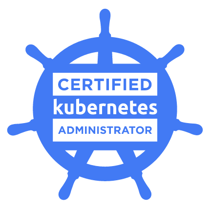
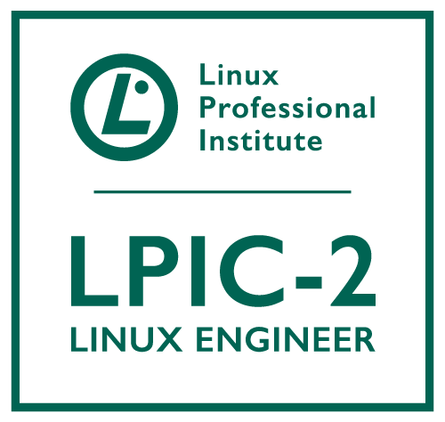
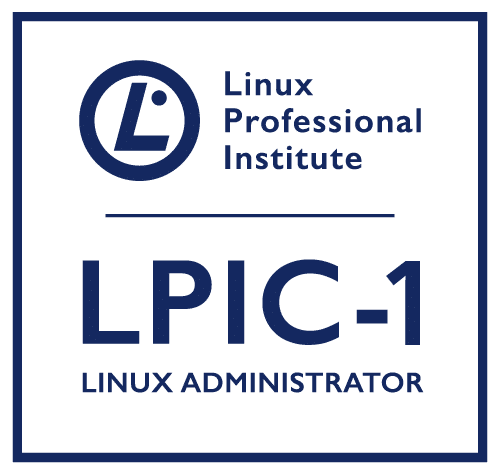

## Welcome! It's me!

My name is Reverson Claudio Dias, I was born in Brazil.  
I left my hometown when I was 18 years old to start my college, I'm bachelor in Computation Science I ends my college in 2011 at Universidade São Francisco. I lived in Itaiba until finished my college after that I moved to Campinas where I lived for 4 year. And I moved to São Paulo where I currently lived, I'm here for 5 years and here I started my DevOps journey. =)  
Currently I'm working at ThoughtWorks as Sr. Infrastructure Consultant, where I performing a role to implement the best practcies from DevOps culture, showing to the customers what they can use to get the best performance and results about their services or producties or help them to improve their current environment.

### A Professional Shot 

I working for more than 5 years with a cloud computing environment and ever I involved with new challenges about new methodologies and tools. I'm passionate to process automation and design solutions. I've been focused on implementing DevOps culture through the companies where I worked.

### The Last Project I Worked

- I write terraform modules to delevery AWS infrastructure as a code. That codes are using in a CI/CD pipeline to delivery the infrastructure on-demand for the developers.

- I deployed a project based on infrastructure as a code.Through the a continuous delivery tool and integrated with a github repository I deployed a influxDB and influxDB relay on AWS platform. For delivered it I used tools like Terrafor, Ansible and Shell Scripts. And Every modification that must be necessary it had to be through by the github repository.

- I refurbished the metrics platform with Prometheus and Thanos. I made a cross integrate two AWS regions, in the other words, there are two metrics environments on two AWS regions, but they can access each other. That metrics platform are integrated with AWS and Kubernetes cluster, each one on your region.

- I helped QA team to create an automation to help them with some tests. Based on manually tests I used the AWS platform with some resources like Event Bridge, Lambda Functions end EC2 to create a flow 100% automatized with feedback through a message channel. Every thing that we did following the infrastructure as a code conceptions.


### Some Tools I Have Been Already Worked

```
- AWS (Route53, EC2, S3, VPC, Lambda, Elastic Cache, RDS, ASG, etc)
- Terraform
- Kubernentes
- Prometheus+Thanos
- CircleCi
- Ansible
- Hashicorp Packer
- Scripts: Shell and Python
- Hashicorp Vault and Consul
- Github
- Docker
- Ansible
- Hashicorp Packer
```

### My Certificates

{:height="250px" width="250px"}

{:height="250px" width="250px"}

{:height="250px" width="250px"}
