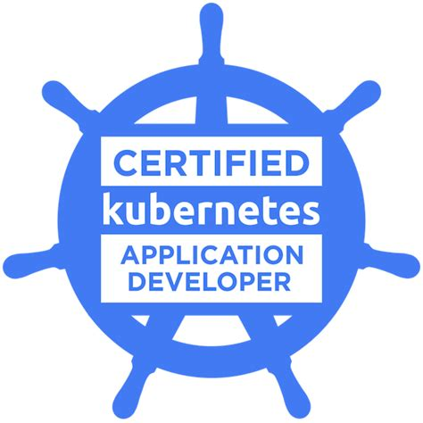

## Welcome! It's me!

Hello! My name is Reverson Claudio Dias and I was born in Brazil in 1989.  
I have left my hometown when I was 18 years old to start the college. I'm bachelor's in Computation Science and I have finished the college in 2011 at Universidade São Francisco. I have lived in the countryside until to finish the college and to get more professional experience. Then I have moved to São Paulo this is the biggest city in Brazil where I have started my DevOps journey. I have lived there almost 7 years.  
Currently, I have been living in Portugal. I'm working at [Bosh - Ovar](https://www.bosch.pt/a-nossa-empresa/bosch-em-portugal/ovar/) as Sr. Infrastructure Eng. My main role here is to help to implement the best practices to use Kubernetes with GitOps approach to delivery the applications and resources in the Kubernetes cluster.

### A Professional Shot

I have worked for more than 5 years with cloud computing (on premises and as a service) and I ever have been involved with new challenges about new methodologies and tools. I I have been focused in to implement DevOps culture through the companies where I have worked. I'm passionate for Linux (Open Source projects), Kubernetes and Cloud Computing!  
And I love to make automation to improve CI/CD pipelines and integrations between the services.

### The Last Project I Worked

- I have wrote terraform modules to deliver AWS infrastructure as a code. Those codes were used in a CI/CD (Jenkins) pipeline to deliver the infrastructure on-demand for the developers.

- I have deployed a project based in infrastructure as a code. Through the continuous integration tool CircleCI that integrates with a Github repository then it deliveries an influxDB and an influxDB-relay in the AWS platform (EC2, subnets, VPC, etc). To delivery it I have used tools like Terraform, Ansible, and Shell Scripts. Every modification would be done in the GitHub repository to use it as a source of truth.

- I have refurbished one metrics platform switch off from a vanilla Prometheus to Prometheus and Thanos services. I have made a cross integration between two AWS regions for different Prometheus installation using the Thanos solution to support the high availability. The environments are isolated but the metrics are crossed and thouse could be accessed from any region. Those metrics platforms are integrated with AWS and clusters Kubernetes scraping EC2 and the Kubernetes resources.

- I have helped a QA team to create an automation to help them with some tests. Based on manual tests I have used the AWS platform with some resources like Event Bridge, Lambda Functions end EC2 to create a flow 100% automatized with feedback through a message channel(Slack).

- I have migrate an environment from EC2 deployed and configured by Ansible to Kubernetes using FluxCD to deploy the services and application in the Kubernetes cluster. The process has covered to create the Helm charts, installation of Ingress controllers, external secrets integration and all Kubernetes cluster configuration are stored in a Github repository and used as a monorepo.

### Some Tools I Have Been Already Worked

```
- AWS (Route53, EC2, S3, VPC, Lambda, Elastic Cache, RDS, ASG, etc)
- Terraform
- Kubernentes
- Prometheus+Thanos
- CircleCi
- Ansible
- Scripts Shell
- Hashicorp Vault
- Hashicorp Consul
- Hashicorp Packer
- Github
- GitLab
- Git
- Docker
- Ansible
- Hashicorp Packer
- Opensatck
- Bitbucket
- ArgoCD
- Golang
- Python
- FluxCD
```

### My Certificates

{:height="100px" width="100px"}
{:height="100px" width="100px"}
{:height="100px" width="100px"}
{:height="100px" width="100px"}
