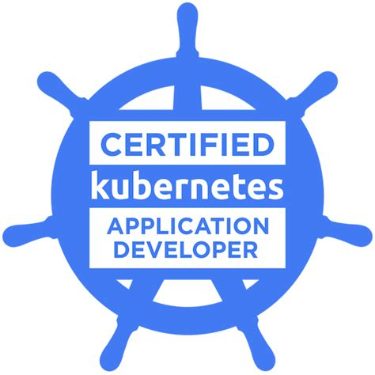
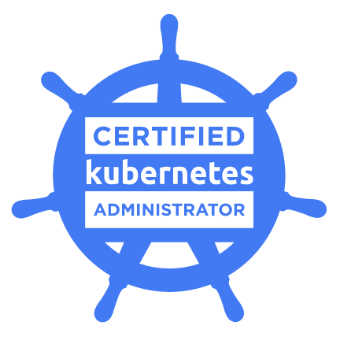
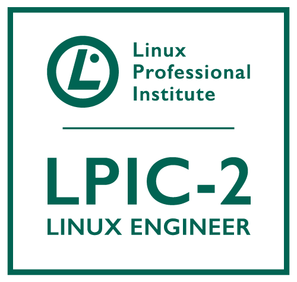
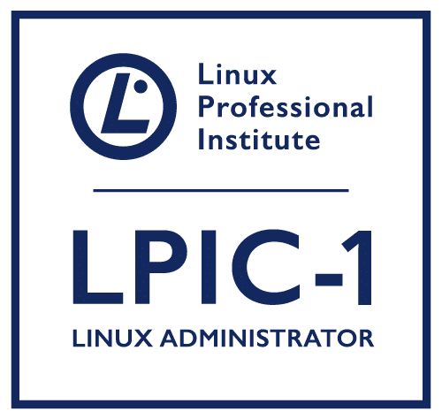

## Welcome! It's me!

Hello! My name is Reverson Claudio Dias and I was born in Brazil in 1989.  
I have left my hometown when I was 18 years old to start the college. I'm bachelor's in Computation Science and I have finished the college in 2011 at Universidade São Francisco. I have lived in the countryside until to finish the college and to get more professional experience. Then I have moved to São Paulo, it is the biggest city in Brazil where I have started my DevOps journey. I have lived there almost 7 years.  
I have moded to Portugal in 2021 and I have been living in Braga.Currently, I'm working at [Continental Tires](https://www.continental-tires.com/) as Sr. Cloud Eng. My main role here is to consult for interal team to desing and architect solution in AWS cloud.

### A Short Professional

I have worked for more than 5 years with cloud computing (on premises and as a service) and I ever have been involved with new challenges about new methodologies and technologies. I have been focused to implement DevOps culture through the companies where I have worked. I'm passionate for Linux (Open Source projects), Kubernetes and Cloud Computing!  
And I love to make automation to improve CI/CD pipelines and integrations services.

### Projects I Have Worked

- I have wrote terraform modules to deliver AWS infrastructure as code. Those codes were used in a CI/CD (Jenkins) pipeline to deliver the infrastructure on-demand for the developers.

- I have deliverd a project based on infrastructure as code: Through continuous integration tool CircleCI, integrated with a GitHub repository, it is delivering an influxDB and an influxDB-relay in the AWS platform (EC2, subnets, VPC, etc). To delivery it I have used tools like Terraform, Ansible, and Shell Scripts. Every modification would be done in the GitHub repository using it as a source of truth.

- I have re-archtect one metrics platform replacing a vanilla Prometheus installation to Prometheus and Thanos services installation. I have made a cross integration between two AWS regions for different Prometheus installation using the Thanos solution to support the high availability. The environments are isolated but the metrics are crossed and those could be accessed from any region. Those metrics platforms are integrated with AWS and clusters Kubernetes, it scrapes both EC2 and the Kubernetes resources.

- I have helped the QA team to create an automation to help them with some tests. Based on manual tests I have used the AWS with some resources like Event Bridge, Lambda Functions end EC2 to create a flow 100% automatized with feedback through a message channel(Slack).

- I have migrated an environment from EC2 deployed and configured by Ansible to Kubernetes using FluxCD to deploy the services and application in the Kubernetes cluster. The process has covered to create the Helm charts, installation of Ingress controllers, external secrets integration and all Kubernetes cluster configuration are stored in a Github repository and used as a monorepo. All deployment were made by GitOps apporach, FluxCD can able us to do it.

### Some Tools I Have Been Already Worked

```
- AWS
- Terraform
- Kubernentes
- Prometheus+Thanos
- CircleCi
- Ansible
- Scripts Shell
- Hashicorp Vault
- Hashicorp Consul
- Hashicorp Packer
- Github+GitHub Actions
- GitLab
- Git
- Docker
- Podman
- Ansible
- Opensatck
- Bitbucket
- ArgoCD
- Golang
- Python
- FluxCD
- Opensearch
- Jenkins
```

### My Certificates

{:height="100px" width="100px"}
{:height="100px" width="100px"}
{:height="100px" width="100px"}
{:height="100px" width="100px"}
